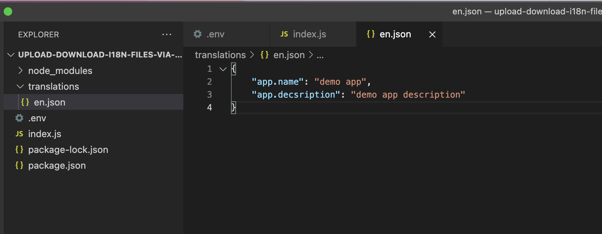
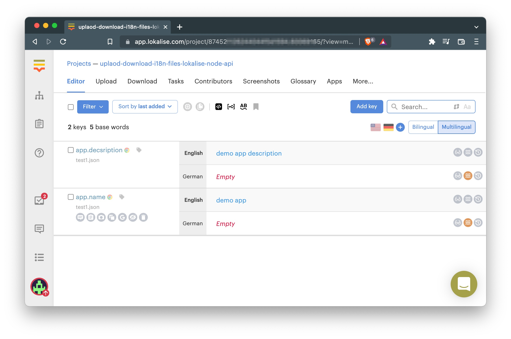

# Upload translation file to your Lokalise project using Nodejs SDK
This tutorial will show you how to use the Lokalise Nodejs SDK to upload your translation file to your Lokalise project.


## prerequisites

This guide assumes you have a Lokalise project( if not, [create your Lokalise project](https://docs.lokalise.com/en/articles/2983736-onboarding-guide-for-project-managers#start-a-project)), and if you want to follow this guide locally on your computer, you need to have these things installed:
[Node.js](https://nodejs.org/en/), [npm](https://www.npmjs.com/) and a code editor.


## Creating a project

Create a project directory by running the following with your project name.

```shell
    mkdir YOUR_APP_NAME
```

Navigate to your project folder and make it a node project by running the following command.

```shell
    cd YOUR_APP_NAME && npm init -y
```

It will create a `package.json` file. It should look similar to this.


## Install dependencies 

Install `@lokalise/node-api` and `dotenv` packages and save them to your `package.json` dependencies using the following command.

```shell
    npm install @lokalise/node-api dotenv
```

## Getting an API token to use the Lokalise API

Create  `.env`  file on the root of the project and add your Lokalise API token. Make sure to API token with **read** and **write** access to your Lokalise projects. [How to get Lokalise API token?](https://docs.lokalise.com/en/articles/1929556-api-tokens)

```env
    LOKALISE_API_TOKEN=<YOUR_LOKALISE_API_TOKEN>
```

Create a new file called `index.js` on the root of the project and import dependencies by adding the following code:

```js
    const { LokaliseApi } = require('@lokalise/node-api');
    require('dotenv').config();
```

## Initializing the Client

Add the following code to `index.js` to read the Lokalise API token from the environment variable and initialize the Lokalise API client.

```js
    const { LOKALISE_API_TOKEN } = process.env;
    const lokaliseApi = new LokaliseApi({ apiKey: LOKALISE_API_TOKEN});
```


## Get your Lokalise project id

Add the following code to  `index.js`  and replace `<YOUR_PROjECT_ID> ` with your Lokalise project id. [How to get the Lokalise project id?](https://docs.lokalise.com/en/articles/1400460-projects#project-id)

```js
    const lokaliseProjectId = '<YOUR_PROjECT_ID>';
```

Your `index.js` file should like similar to this.


## Add translation file

Create a translations folder on the root for the project, add an en.json file, and add the following keys.

```json
      {
        "app.name": "demo app",
        "app.decsription": "demo app description"
    }
```




## Upload translation file to your Lokalise project


You need to provide translation keys data as [base64](https://en.wikipedia.org/wiki/Base64). You can use the [node Buffer](https://nodejs.org/api/buffer.html) class to store raw translation data and convert it to base64. 

Add the following code to your `index.js` file to upload the translation keys to your Lokalise project using [Lokalise node api client](https://lokalise.github.io/node-lokalise-api/).

```js
    const englishI18nFile = require('./translations/en.json');
    const filename = 'en.json';
    const lang_iso = 'en';
    (async function () {
        try {
            const data_base64 = Buffer.from(JSON.stringify(englishI18nFile)).toString("base64");
            process = await lokaliseApi.files().upload(lokaliseProjectId,
                { data: data_base64, filename, lang_iso }
            );
            console.log('upload process --->', process.status);
        } catch (error) {
            console.log('ERROR --->', error);
        }
    })();
```

This code defines the path to your translation file, desired file name, and language ISO code. Provides translation keys data as [base64](https://en.wikipedia.org/wiki/Base64) using [node Buffer](https://nodejs.org/api/buffer.html) class to store raw translation data and convert it to base64. The async function will trigger to upload translation keys to your Lokalise project.

Your `index.js` file should look similar to this. 
```js
    const { LokaliseApi } = require('@lokalise/node-api');
    require('dotenv').config()
    const { LOKALISE_API_TOKEN } = process.env;
    const lokaliseApi = new LokaliseApi({ apiKey: LOKALISE_API_TOKEN });
    const lokaliseProjectId = '874521126244044f0d1594.60069165';
    
    const englishI18nFile = require('./translations/en.json');
    const filename = 'en.json';
    const lang_iso = 'en';
    (async function () {
        try {
            const data_base64 = Buffer.from(JSON.stringify(englishI18nFile)).toString("base64");
            process = await lokaliseApi.files().upload(lokaliseProjectId,
                { data: data_base64, filename, lang_iso }
            );
            console.log('upload process --->', process.status);
        } catch (error) {
            console.log('ERROR --->', error);
        }
    })();
```

Back at the command line, run this command to trigger the upload translation file to your Lokalise project. 
```shell
    node index.js
```
If the upload is successful, you should be able to see the upload translation keys in your Lokalise project.  



## Next steps
- [Explore Lokalise API endpoints and see other possibilities with Lokalise.](https://app.lokalise.com/api2docs/curl/)
- [Checkout Lokalise developer tutorials](https://lokalise.com/blog/category/tutorials/)
